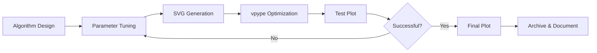

# Pen Plotter Art Overview

#generative-art #pen-plotter #creative-coding #overview

## Project Vision

This project explores the intersection of algorithmic art and physical pen plotting, creating unique generative artworks that bridge the digital and physical worlds. Each piece is computed through mathematical algorithms and brought to life through precise mechanical drawing.

## Hardware Setup

### Plotters
- **iDraw 2.0 H-Stand** (A3 format)
  - Primary workhorse for daily experiments
  - Excellent precision for detailed work
- **A0 Plotter**
  - Large-scale installations
  - Architectural drawings

### Materials
- **Pens**: 200+ collection including:
  - Technical pens (0.1mm - 1.0mm)
  - Gel pens for color work
  - Metallic and specialty inks
- **Paper**: 
  - Primary: A3 semi-gloss (ideal for ink flow)
  - Special: Watercolor, textured, translucent

## Core Algorithms

### [[Flow-Fields-Algorithm|Flow Fields]]
Mathematical vector fields that create organic, flowing patterns. Based on Perlin noise and other continuous functions.

### [[Cellular-Automata-Algorithms|Cellular Automata]]
Discrete systems like Conway's Game of Life that evolve complex patterns from simple rules.

### [[Reaction-Diffusion-System|Reaction-Diffusion]]
Chemical simulation algorithms that produce natural-looking patterns like animal markings and coral growth.

### Physics Simulations
- Spring systems
- Gravitational fields
- Particle dynamics
- Magnetic field interactions

### L-Systems & Fractals
- Recursive tree generation
- Plant growth simulation
- Lightning patterns
- Root systems

## Workflow Pipeline

## Technical Stack

### Generation Tools
- **canvas-sketch**: Browser-based sketching with hot reload
- **p5.js**: Quick prototyping and existing library integration
- **vsketch**: Python-based with GUI parameter control
- **Processing**: Java-based for complex simulations

### Optimization Pipeline
- **vpype**: Path optimization, sorting, simplification
- **shapely**: Computational geometry operations
- **custom scripts**: Specialized optimizations

## Creative Philosophy

The beauty of generative art lies in the collaboration between human creativity and mathematical precision. Each algorithm is:

1. **Deterministic yet Surprising**: Same code, different seeds, infinite variety
2. **Physically Constrained**: Respecting pen physics and paper limitations
3. **Aesthetically Curated**: Human judgment guides parameter selection
4. **Process-Documented**: Each piece preserves its generative history

## Project Organization

### Active Development
- `/algorithms/` - Core algorithm implementations
- `/output/raw/` - Fresh generations
- `/parameters/` - Successful parameter sets

### Documentation
- [[Creative-Combinations]] - Hybrid algorithm experiments
- [[Workflow-Guide]] - Detailed process documentation
- [[Parameter-Library]] - Curated successful parameters
- [[Technical-Architecture]] - System design details

### Archives
- Completed series
- Exhibition pieces
- Commission work

## Getting Started

1. **Explore Algorithms**: Start with [[Flow-Fields-Algorithm]] for organic patterns
2. **Run Examples**: Check `/examples/` for ready-to-plot code
3. **Experiment**: Modify parameters in existing algorithms
4. **Create**: Combine techniques from different algorithms

## Daily Practice

### Morning Routine
1. Review yesterday's plots
2. Select algorithm focus
3. Generate 5-10 variations
4. Test plot best candidates

### Documentation
- Photograph final plots
- Save successful parameters
- Note unexpected discoveries
- Archive in appropriate series

## Inspiration Sources

- **Nature**: Growth patterns, fluid dynamics, crystallization
- **Mathematics**: Chaos theory, topology, number theory
- **Art History**: Sol LeWitt, Vera Molnár, Casey Reas
- **Architecture**: Parametric design, generative facades

## Future Directions

- Multi-color layer registration
- 3D pen plotting exploration
- Interactive parameter spaces
- Machine learning integration
- Collaborative plotting systems

---

*"The machine is an extension of the hand, the algorithm an extension of the mind, and the artwork emerges from their collaboration."*

## Related Notes
- [[Flow-Fields-Algorithm]]
- [[Cellular-Automata-Algorithms]]
- [[Reaction-Diffusion-System]]
- [[Creative-Combinations]]
- [[Technical-Architecture]]

#project-root #documentation #getting-started