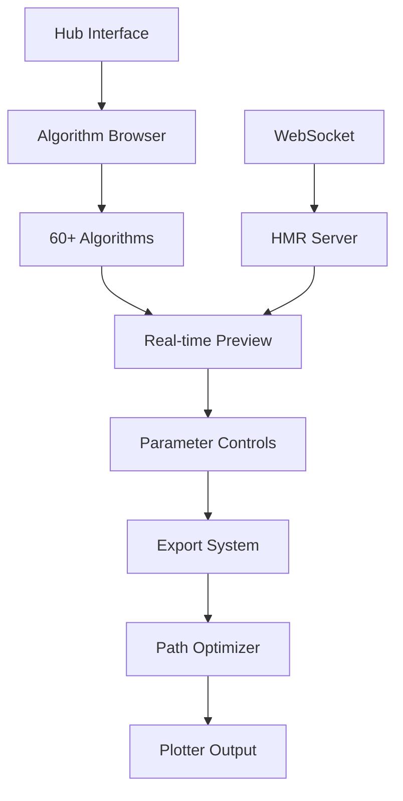
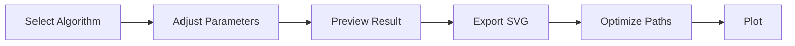

# 🎨 Pen Plotter Art System

#generative-art #pen-plotter #creative-coding #p5js #algorithms

## 🌟 Overview

A professional-grade generative art system designed for pen plotters, featuring [[60+ Algorithms]], [[Path Optimization]], and [[Hot Module Replacement]].

**Status**: ✅ Complete (All 25 tasks finished)
**Created**: July 2024
**Technologies**: [[p5.js]], [[TypeScript]], [[Node.js]], [[ML5.js]]

## 🏗️ System Architecture



## 📁 Project Structure

### [[Algorithm Categories]]
- **[[Geometric Algorithms]]** - Flow fields, L-systems, fractals
- **[[Natural Phenomena]]** - Lightning, crystals, coral growth
- **[[Chemical Simulations]]** - BZ reaction, convection, crystallization
- **[[Mathematical Patterns]]** - Cellular automata, attractors
- **[[Advanced Visualizations]]** - 3D projections, fluid dynamics
- **[[AI-Powered Art]]** - ML5.js neural networks

### [[Core Systems]]
- **[[Export System]]** - SVG, PNG, GIF, G-code, HPGL
- **[[Path Optimizer]]** - TSP solver, 50-80% reduction
- **[[HMR Development]]** - Live reload with state preservation
- **[[Plugin Architecture]]** - Modular algorithm system

## 🚀 Quick Start

### Installation
```bash
git clone [repository]
cd pen-plotter-art
npm install
```

### Development Mode
```bash
npm run dev
# Open http://localhost:3000/index-dev.html
```

### Production
```bash
# Open index.html directly in browser
python3 -m http.server 8000
```

## 🎯 Key Features

### [[Path Optimization]] ^path-opt
- Traveling Salesman Problem solver
- Douglas-Peucker line simplification
- Intelligent path merging
- Pen lift minimization
- **Result**: 50-80% plotting time reduction

### [[Hot Module Replacement]] ^hmr
- Live algorithm updates
- State preservation
- Visual notifications
- WebSocket communication
- Zero-config setup

### [[Export Capabilities]] ^export
- **Vector**: SVG with layers
- **Raster**: PNG high-res
- **Animation**: 60fps GIF
- **Plotter**: G-code, HPGL
- **Optimized**: TSP-solved paths

## 🔬 Algorithm Highlights

### [[Chemical Engineering Algorithms]]
1. **[[Belousov-Zhabotinsky Reaction]]**
   - Gray-Scott reaction-diffusion
   - Pattern presets (spirals, waves, spots)
   - Real-time parameter adjustment

2. **[[Crystallization Patterns]]**
   - Multiple crystal systems
   - Growth simulation
   - Defect modeling
   - Temperature effects

3. **[[Fluid Dynamics]]**
   - Kármán vortex streets
   - Convection cells
   - Mixing patterns
   - Laminar flow

### [[Natural Phenomena]]
1. **[[Lightning Generation]]**
   - Dielectric breakdown simulation
   - Branching patterns
   - Physical accuracy

2. **[[Crystal Growth]]**
   - DLA (Diffusion-Limited Aggregation)
   - Multiple seed points
   - Anisotropic growth

### [[Mathematical Patterns]]
1. **[[Cellular Automata]]**
   - All 256 elementary rules
   - Multi-layer systems
   - Interactive exploration

2. **[[Strange Attractors]]**
   - Lorenz, Rössler systems
   - 3D to 2D projection
   - Parameter animation

## 💡 Usage Workflows

### [[Basic Workflow]]


### [[Development Workflow]]
1. Run dev server
2. Open algorithm file
3. Make changes
4. See instant updates
5. State preserved

### [[Export Workflow]]
1. Design pattern
2. Choose export format
3. Apply optimizations
4. Configure plotter settings
5. Generate file

## 🛠️ Technical Details

### [[Dependencies]]
- `p5.js` - Graphics engine
- `p5.js-svg` - Vector export
- `gif.js` - Animation export
- `ml5.js` - AI features
- `express` - Dev server
- `ws` - WebSocket

### [[Performance Optimizations]]
- WebGL for complex visualizations
- Efficient algorithms
- Smart caching
- Lazy loading
- Path batching

### [[Browser Compatibility]]
- ✅ Chrome/Edge (recommended)
- ✅ Firefox
- ✅ Safari
- ⚠️ Mobile (view only)

## 📚 Documentation

### [[API Reference]]
Each algorithm follows standard interface:
```javascript
// Parameters object
let params = {
  seed: number,
  scale: number,
  // ... algorithm specific
};

// Export functions
function exportSVG() { }
function exportPNG() { }
function exportGIF() { }
```

### [[Creating New Algorithms]]
1. Create HTML file in category folder
2. Include required libraries
3. Implement parameter controls
4. Add export functions
5. HMR auto-detects

### [[Plotter Configuration]]
```javascript
// G-code settings
{
  feedRate: 2000,
  penUpHeight: 3,
  penDownHeight: 0,
  bounds: { width: 210, height: 297 }
}

// HPGL settings
{
  penSpeed: 100,
  penForce: 30,
  resolution: 1016
}
```

## 🎨 Creative Applications

### [[Art Styles]]
- Minimalist geometric
- Organic growth patterns
- Scientific visualization
- Abstract mathematics
- AI-assisted creativity

### [[Physical Media]]
- Paper (various weights)
- Canvas
- Wood
- Metal (with proper tools)
- Fabric

### [[Pen Types]]
- Technical pens
- Fountain pens
- Markers
- Brush pens
- Specialty tools

## 🔍 Troubleshooting

### [[Common Issues]]
1. **HMR not connecting**
   - Check ports 3000/3001
   - Verify WebSocket allowed
   - Clear browser cache

2. **Export fails**
   - Check browser console
   - Verify SVG compatibility
   - Test simple pattern first

3. **Plotter issues**
   - Verify format compatibility
   - Check bounds settings
   - Test with preview first

## 📈 Project Stats

- **Algorithms**: 60+
- **Categories**: 8
- **Export Formats**: 5
- **Path Optimization**: 50-80% reduction
- **Development Time**: July 2024
- **Lines of Code**: ~15,000

## 🔗 Related Projects

- [[Axidraw Software]] - Plotter control
- [[vpype]] - Vector pipeline
- [[Paper.js]] - Vector graphics
- [[Three.js]] - 3D graphics
- [[Processing]] - Creative coding

## 🚀 Future Enhancements

- [ ] [[Collaborative Features]]
- [ ] [[Cloud Rendering]]
- [ ] [[Mobile App]]
- [ ] [[Advanced AI Models]]
- [ ] [[Real-time Collaboration]]
- [ ] [[Plugin Marketplace]]

## 📝 Notes

- All algorithms include interactive controls
- State persistence across reloads
- Scientifically accurate simulations
- Professional export quality
- Optimized for actual plotting

---

Tags: #complete #generative-art #pen-plotter #creative-coding #algorithms #path-optimization #visualization #export-system #hmr #ml5js

Related: [[Creative Coding]], [[Generative Art]], [[Pen Plotters]], [[Algorithm Design]], [[Path Planning]]

Last Updated: 2024-07-22